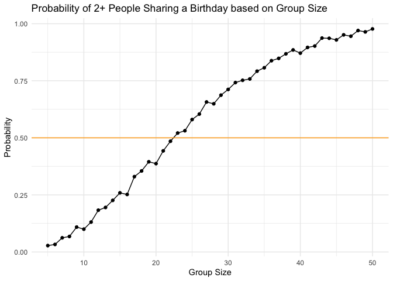
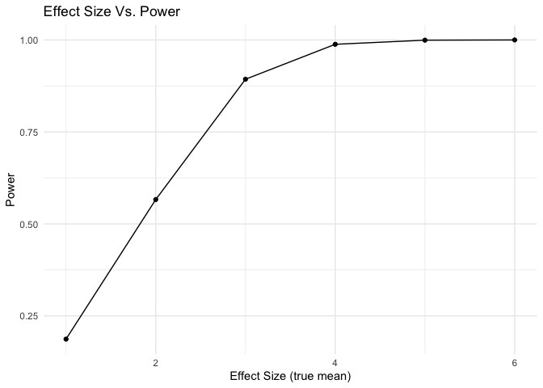

p8105_hw5_jg5038
================
Julia Gray
2025-11-05

## Problem 1: Birthday problem

``` r
#define data generating mechanism
birthdays = sample(1:365, 5, replace = TRUE)

#run the analysis
repeated_bday = length(unique(birthdays)) < 5

#return the result
repeated_bday
```

    ## [1] FALSE

put this in a function

``` r
bday_sim = function(n_room) {
  
  birthdays = sample(1:365, n_room, replace = TRUE)

  repeated_bday = length(unique(birthdays)) < n_room

  repeated_bday
}

#bday_sim(20)
```

``` r
bday_sim_results = 
  expand_grid(
    bdays = 5:50,
    iter = 1:1000
  ) |> 
  mutate(
    result = map_lgl(bdays, bday_sim)
  ) |> 
  group_by (
    bdays
  ) |> 
  summarize(
    prob_repeat = mean(result)
  )
```

Plot results (test):

``` r
bday_sim_results |> 
  ggplot(aes(x = bdays, y = prob_repeat)) +
  geom_point() +
  geom_line() +
  geom_hline(yintercept = 0.5, color = "orange") +
  labs(
    title = "Probability of 2+ People Sharing a Birthday based on Group Size",
    x = "Group Size",
    y = "Probability"
  )
```



### Problem 2

Problem 2 = if you’re study is underpowered, you’re going to
overestimate effect size. If only see significant results = not getting
idea of what real value is

``` r
#set model params
n = 30
sigma = 5
mu = 0

n_trials = 5000
alpha = 0.05

#create simulation function
norm_dist_sim_fn = function (mu = 0, n = 30, sigma = 5, alpha = 0.05) {
  
  #generate data
  norm_vec = rnorm(n = n, mean = mu, sd = sigma)
  
  #run ttest and return estimate & p.value
  t.test(norm_vec, mu = 0, conf.level = 1-alpha) |> 
    broom::tidy() |> 
    select(estimate, p.value)
}
```

Run for mu = 0

``` r
#test = norm_dist_sim_fn(mu=mu)

#run for mu = 0
norm_sim_results_0 = 
  expand_grid(
    mean = mu,
    iter = 1:n_trials
  ) |> 
  mutate(
    t_results = map(mean, norm_dist_sim_fn)
  ) |> 
  unnest(t_results)

#run for mu in {1, 2, 3, 4, 5, 6}
norm_sim_results = 
  expand_grid(
    mean = 1:6,
    iter = 1:n_trials
  ) |> 
  mutate(
    t_results = map(mean, norm_dist_sim_fn)
  ) |> 
  unnest(t_results)
```

Plot the results:

``` r
norm_sim_results |> 
  group_by(mean) |> 
  summarize(
    power = sum(p.value < alpha) /  n()
  ) |> 
  ggplot(aes(x = mean, y = power)) +
  geom_point() +
  geom_line()
```


