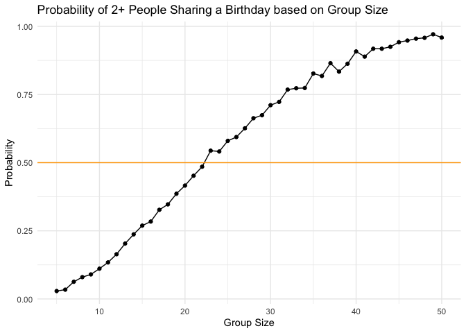
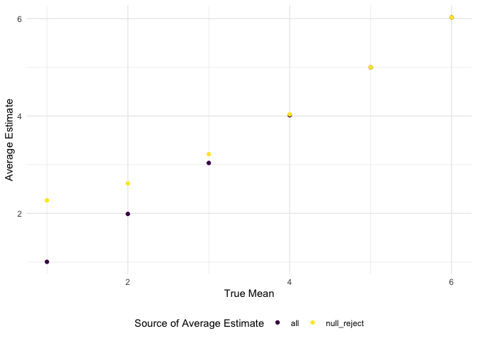
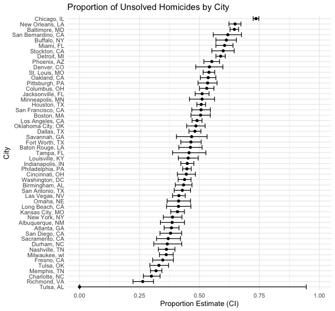

p8105_hw5_jg5038
================
Julia Gray
2025-11-05

## Problem 1: Birthday problem

Create a function to simulate birhday sampling in a room with a set
number of subjects (n_room):

``` r
bday_sim = function(n_room) {
  
  birthdays = sample(1:365, n_room, replace = TRUE)

  repeated_bday = length(unique(birthdays)) < n_room

  repeated_bday
}

#bday_sim(20)
```

Run the simulation 1000 times for groups of size 5-50:

``` r
bday_sim_results = 
  expand_grid(
    bdays = 5:50,
    iter = 1:1000
  ) |> 
  mutate(
    result = map_lgl(bdays, bday_sim)
  ) |> 
  group_by (
    bdays
  ) |> 
  summarize(
    prob_repeat = mean(result)
  )
```

Plot results:

``` r
bday_sim_results |> 
  ggplot(aes(x = bdays, y = prob_repeat)) +
  geom_point() +
  geom_line() +
  geom_hline(yintercept = 0.5, color = "orange") +
  labs(
    title = "Probability of 2+ People Sharing a Birthday based on Group Size",
    x = "Group Size",
    y = "Probability"
  )
```



The probability of 2 people sharing a birthday is hits 50% when the
group size is at least 23.

### Problem 2

Set model params and create function:

``` r
#set model params
n = 30
sigma = 5
mu = 0

n_trials = 5000
alpha = 0.05

#create simulation function
norm_dist_sim_fn = function (mu = 0, n = 30, sigma = 5, alpha = 0.05) {
  
#generate data
norm_vec = rnorm(n = n, mean = mu, sd = sigma)
  
#run ttest and return estimate & p.value
t.test(norm_vec, mu = 0, conf.level = 1-alpha) |> 
  broom::tidy() |> 
  select(estimate, p.value)
}
```

Run for mu = 0

``` r
#test = norm_dist_sim_fn(mu=mu)

#run for mu = 0
norm_sim_results_0 = 
  expand_grid(
    mean = mu,
    iter = 1:n_trials
  ) |> 
  mutate(
    t_results = map(mean, norm_dist_sim_fn)
  ) |> 
  unnest(t_results)
```

Run for mu in {1, 2, 3, 4, 5, 6}

``` r
#run for mu in {1, 2, 3, 4, 5, 6}
norm_sim_results = 
  expand_grid(
    mean = 1:6,
    iter = 1:n_trials
  ) |> 
  mutate(
    t_results = map(mean, norm_dist_sim_fn)
  ) |> 
  unnest(t_results)
```

Plot the results:

``` r
norm_sim_results |> 
  group_by(mean) |> 
  summarize(
    power = sum(p.value < alpha) /  n()
  ) |> 
  ggplot(aes(x = mean, y = power)) +
  geom_point() +
  geom_line() +
  labs(
    title = "Effect Size Vs. Power",
    x = "Effect Size (true mean)",
    y = "Power"
  )
```


We can see there is a positive correlation between effect size and
power. When the effect size is small, the power is low meaning the
frequency of null hypothesis getting rejected goes down. As the effect
size goes up the power approaches 1, meaning the null hypothesis is more
frequently getting rejected.

``` r
avg_estimates = norm_sim_results |> 
  mutate(
    null_reject = (p.value < 0.05)
  )

all_sample_avg_estimates = avg_estimates |> 
  group_by(mean) |> 
  summarize(avg_estimate = mean(estimate), n = n()) |> 
  mutate(sample = 'all')

null_reject_avg_estimates = avg_estimates |> 
  filter(null_reject == TRUE) |> 
  group_by(mean) |> 
  summarize(avg_estimate = mean(estimate), n = n()) |> 
  mutate(sample = 'null_reject')

rbind(all_sample_avg_estimates, null_reject_avg_estimates) |> 
  ggplot(aes(x = mean, y = avg_estimate, color = sample)) + 
  geom_point() + 
  labs(
    color = "Source of Average Estimate",
    x = "True Mean",
    y = "Average Estimate"
  )
```



At larger effect sizes we can see that $\hat{\mu}$ is approximately
equal to the true ${\mu}$. When the effect size is low, the power is low
and we frequently fail to reject the null hypothesis.

### Problem 3

``` r
homicide_df = read.csv("https://raw.githubusercontent.com/washingtonpost/data-homicides/master/homicide-data.csv") |> 
  janitor::clean_names() |> 
  mutate(
    reported_date = as.Date(as.character(reported_date), format = "%y%m%d"),
    city_state = paste(city, state, sep=", ")
  )
```

The Washington Post dataset on homicides contains 52179 observations.
Each observation is a homicide and contains columns for uid,
reported_date, victim_last, victim_first, victim_race, victim_age,
victim_sex, city, state, lat, lon, disposition, city_state.

``` r
homicide_df |> 
  filter(disposition %in% c("Closed without arrest", "Open/No arrest")) |> 
  group_by(city_state) |> 
  summarize(unsolved_homicides = n()) |> 
  knitr::kable()
```

| city_state         | unsolved_homicides |
|:-------------------|-------------------:|
| Albuquerque, NM    |                146 |
| Atlanta, GA        |                373 |
| Baltimore, MD      |               1825 |
| Baton Rouge, LA    |                196 |
| Birmingham, AL     |                347 |
| Boston, MA         |                310 |
| Buffalo, NY        |                319 |
| Charlotte, NC      |                206 |
| Chicago, IL        |               4073 |
| Cincinnati, OH     |                309 |
| Columbus, OH       |                575 |
| Dallas, TX         |                754 |
| Denver, CO         |                169 |
| Detroit, MI        |               1482 |
| Durham, NC         |                101 |
| Fort Worth, TX     |                255 |
| Fresno, CA         |                169 |
| Houston, TX        |               1493 |
| Indianapolis, IN   |                594 |
| Jacksonville, FL   |                597 |
| Kansas City, MO    |                486 |
| Las Vegas, NV      |                572 |
| Long Beach, CA     |                156 |
| Los Angeles, CA    |               1106 |
| Louisville, KY     |                261 |
| Memphis, TN        |                483 |
| Miami, FL          |                450 |
| Milwaukee, wI      |                403 |
| Minneapolis, MN    |                187 |
| Nashville, TN      |                278 |
| New Orleans, LA    |                930 |
| New York, NY       |                243 |
| Oakland, CA        |                508 |
| Oklahoma City, OK  |                326 |
| Omaha, NE          |                169 |
| Philadelphia, PA   |               1360 |
| Phoenix, AZ        |                504 |
| Pittsburgh, PA     |                337 |
| Richmond, VA       |                113 |
| Sacramento, CA     |                139 |
| San Antonio, TX    |                357 |
| San Bernardino, CA |                170 |
| San Diego, CA      |                175 |
| San Francisco, CA  |                336 |
| Savannah, GA       |                115 |
| St. Louis, MO      |                905 |
| Stockton, CA       |                266 |
| Tampa, FL          |                 95 |
| Tulsa, OK          |                193 |
| Washington, DC     |                589 |

Prop test for Baltimore:

``` r
prop_test_baltimore = 
  homicide_df |> 
  filter(city_state == "Baltimore, MD") |> 
  summarize(
    n_unsolved = sum(disposition %in% c("Closed without arrest", "Open/No arrest")),
    n_total = n()
  ) |> 
  with(prop.test(x = n_unsolved, n = n_total))

prop_test_baltimore |> 
  broom::tidy() |> 
  select(estimate, conf.low, conf.high) |> 
  knitr::kable()
```

|  estimate |  conf.low | conf.high |
|----------:|----------:|----------:|
| 0.6455607 | 0.6275625 | 0.6631599 |

Prop test for all cities:

``` r
prop_test_all_cities = 
  homicide_df |> 
  group_by(city_state) |> 
  summarize(
    n_unsolved = sum(disposition %in% c("Closed without arrest", "Open/No arrest")),
    n_total = n()
  ) |> 
  mutate(
    prop_test = map2(n_unsolved, n_total, prop.test),
    results = map(prop_test, broom::tidy)
  ) |> 
  unnest(results) |> 
  select(city_state, estimate, conf.low, conf.high)
```

    ## Warning: There was 1 warning in `mutate()`.
    ## ℹ In argument: `prop_test = map2(n_unsolved, n_total, prop.test)`.
    ## Caused by warning in `.f()`:
    ## ! Chi-squared approximation may be incorrect

``` r
prop_test_all_cities |> 
  knitr::kable(digits = 3)
```

| city_state         | estimate | conf.low | conf.high |
|:-------------------|---------:|---------:|----------:|
| Albuquerque, NM    |    0.386 |    0.337 |     0.438 |
| Atlanta, GA        |    0.383 |    0.353 |     0.415 |
| Baltimore, MD      |    0.646 |    0.628 |     0.663 |
| Baton Rouge, LA    |    0.462 |    0.414 |     0.511 |
| Birmingham, AL     |    0.434 |    0.399 |     0.469 |
| Boston, MA         |    0.505 |    0.465 |     0.545 |
| Buffalo, NY        |    0.612 |    0.569 |     0.654 |
| Charlotte, NC      |    0.300 |    0.266 |     0.336 |
| Chicago, IL        |    0.736 |    0.724 |     0.747 |
| Cincinnati, OH     |    0.445 |    0.408 |     0.483 |
| Columbus, OH       |    0.530 |    0.500 |     0.560 |
| Dallas, TX         |    0.481 |    0.456 |     0.506 |
| Denver, CO         |    0.542 |    0.485 |     0.598 |
| Detroit, MI        |    0.588 |    0.569 |     0.608 |
| Durham, NC         |    0.366 |    0.310 |     0.426 |
| Fort Worth, TX     |    0.464 |    0.422 |     0.507 |
| Fresno, CA         |    0.347 |    0.305 |     0.391 |
| Houston, TX        |    0.507 |    0.489 |     0.526 |
| Indianapolis, IN   |    0.449 |    0.422 |     0.477 |
| Jacksonville, FL   |    0.511 |    0.482 |     0.540 |
| Kansas City, MO    |    0.408 |    0.380 |     0.437 |
| Las Vegas, NV      |    0.414 |    0.388 |     0.441 |
| Long Beach, CA     |    0.413 |    0.363 |     0.464 |
| Los Angeles, CA    |    0.490 |    0.469 |     0.511 |
| Louisville, KY     |    0.453 |    0.412 |     0.495 |
| Memphis, TN        |    0.319 |    0.296 |     0.343 |
| Miami, FL          |    0.605 |    0.569 |     0.640 |
| Milwaukee, wI      |    0.361 |    0.333 |     0.391 |
| Minneapolis, MN    |    0.511 |    0.459 |     0.563 |
| Nashville, TN      |    0.362 |    0.329 |     0.398 |
| New Orleans, LA    |    0.649 |    0.623 |     0.673 |
| New York, NY       |    0.388 |    0.349 |     0.427 |
| Oakland, CA        |    0.536 |    0.504 |     0.569 |
| Oklahoma City, OK  |    0.485 |    0.447 |     0.524 |
| Omaha, NE          |    0.413 |    0.365 |     0.463 |
| Philadelphia, PA   |    0.448 |    0.430 |     0.466 |
| Phoenix, AZ        |    0.551 |    0.518 |     0.584 |
| Pittsburgh, PA     |    0.534 |    0.494 |     0.573 |
| Richmond, VA       |    0.263 |    0.223 |     0.308 |
| Sacramento, CA     |    0.370 |    0.321 |     0.421 |
| San Antonio, TX    |    0.429 |    0.395 |     0.463 |
| San Bernardino, CA |    0.618 |    0.558 |     0.675 |
| San Diego, CA      |    0.380 |    0.335 |     0.426 |
| San Francisco, CA  |    0.507 |    0.468 |     0.545 |
| Savannah, GA       |    0.467 |    0.404 |     0.532 |
| St. Louis, MO      |    0.540 |    0.515 |     0.564 |
| Stockton, CA       |    0.599 |    0.552 |     0.645 |
| Tampa, FL          |    0.457 |    0.388 |     0.527 |
| Tulsa, AL          |    0.000 |    0.000 |     0.945 |
| Tulsa, OK          |    0.331 |    0.293 |     0.371 |
| Washington, DC     |    0.438 |    0.411 |     0.465 |

Graph the results:

``` r
prop_test_all_cities |> 
  mutate(
    city_state = fct_reorder(city_state, estimate)
    ) |> 
  ggplot(aes(y = city_state, x = estimate)) + 
  geom_point() + 
  geom_errorbar(aes(xmin = conf.low, xmax = conf.high)) +
  xlim(0, 1) + 
  labs(
    title = "Proportion of Unsolved Homicides by City",
    y = "City",
    x = "Proportion Estimate (CI)"
  )
```


